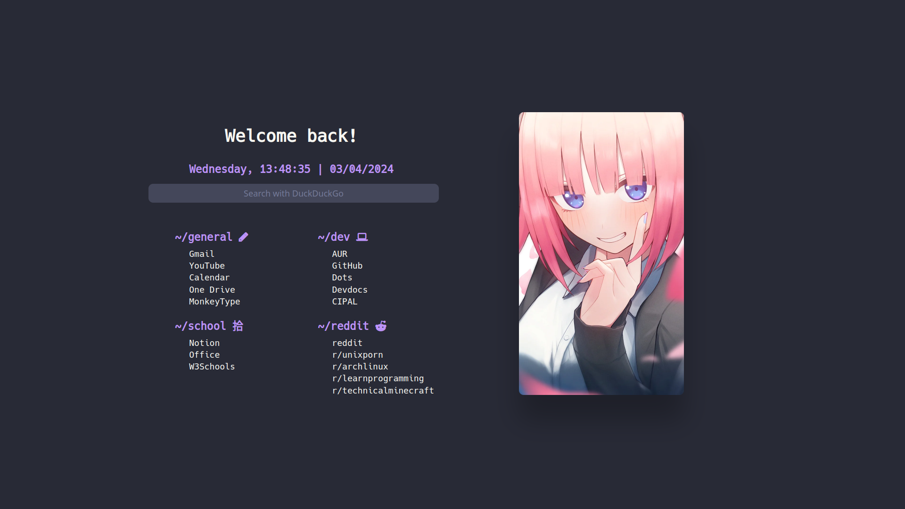

# Startpage

This is my personalized startpage, designed to be my browser homepage. It includes quick links to my favorite websites, a search bar, and a minimalist layout.

## Screenshot

## Usage

1. Clone this repository: `git clone https://github.com/druxorey/startpage.git`
2. Open `index.html` in your browser.
3. Customize the links and style according to your preferences.

## Customization

You can personalize the startpage by editing the `index.html` file. Change the links, colors, and styles in the `style.css` to suit your needs.

## Credits

This is inspired by [Fxzii Startpage](https://github.com/Fxzzi/startpage).